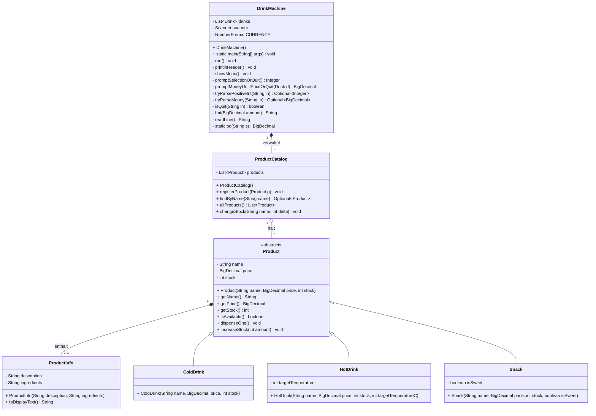

```mermaid
classDiagram
    class DrinkMachine {
        - List~Drink~ drinks
        - Scanner scanner
        - NumberFormat CURRENCY

        + DrinkMachine()
        + static main(String[] args) void

        - run() void
        - printlnHeader() void
        - showMenu() void
        - promptSelectionOrQuit() Integer
        - promptMoneyUntilPriceOrQuit(Drink d) BigDecimal
        - tryParsePositiveInt(String in) Optional~Integer~
        - tryParseMoney(String in) Optional~BigDecimal~
        - isQuit(String in) boolean
        - fmt(BigDecimal amount) String
        - readLine() String
        - static bd(String s) BigDecimal
    }

    class Product {
        <<abstract>>
        - String name
        - BigDecimal price
        - int stock
        + Product(String name, BigDecimal price, int stock)
        + getName() String
        + getPrice() BigDecimal
        + getStock() int
        + isAvailable() boolean
        + dispenseOne() void
        + increaseStock(int amount) void
    }

    class ColdDrink {
        + ColdDrink(String name, BigDecimal price, int stock)
    }

    class HotDrink {
        - int targetTemperature
        + HotDrink(String name, BigDecimal price, int stock, int targetTemperatureC)
    }

    class Snack {
        - boolean isSweet
        + Snack(String name, BigDecimal price, int stock, boolean isSweet)
    }

    class ProductInfo {
        - String description
        - String ingredients
        + ProductInfo(String description, String ingredients)
        + toDisplayText() String
    }

    class ProductCatalog {
        - List~Product~ products
        + ProductCatalog()
        + registerProduct(Product p) void
        + findByName(String name) Optional~Product~
        + allProducts() List~Product~
        + changeStock(String name, int delta) void
    }

    DrinkMachine "1" *-- "1" ProductCatalog : verwaltet
    ProductCatalog "1" o-- "*" Product : hält
    Product "1" *-- "0..1" ProductInfo : enthält
    Product <|-- ColdDrink
    Product <|-- HotDrink
    Product <|-- Snack
```