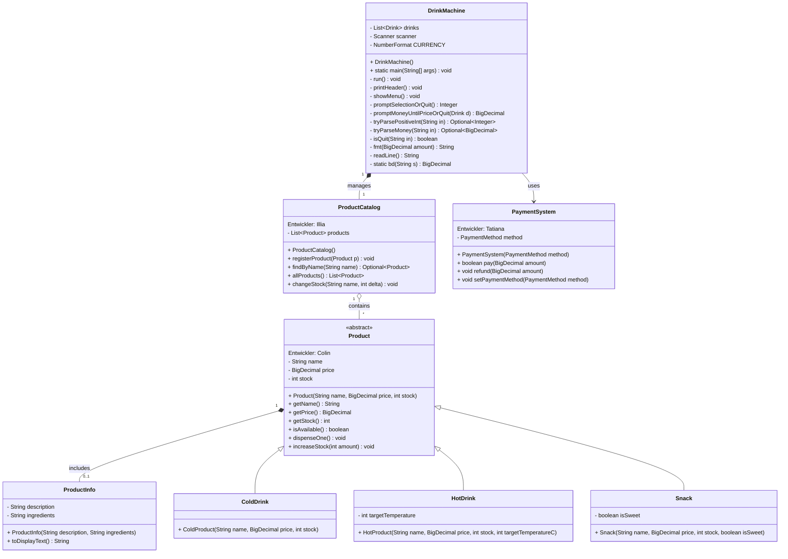

```mermaid
classDiagram
  class DrinkMachine {
      - List~Drink~ drinks
      - Scanner scanner
      - NumberFormat CURRENCY

      + DrinkMachine()
      + static main(String[] args) void

      - run() void
      - printHeader() void
      - showMenu() void
      - promptSelectionOrQuit() Integer
      - promptMoneyUntilPriceOrQuit(Drink d) BigDecimal
      - tryParsePositiveInt(String in) Optional~Integer~
      - tryParseMoney(String in) Optional~BigDecimal~
      - isQuit(String in) boolean
      - fmt(BigDecimal amount) String
      - readLine() String
      - static bd(String s) BigDecimal
  }

  class Product {
      Entwickler: Colin
      <<abstract>>
      - String name
      - BigDecimal price
      - int stock
      + Product(String name, BigDecimal price, int stock)
      + getName() String
      + getPrice() BigDecimal
      + getStock() int
      + isAvailable() boolean
      + dispenseOne() void
      + increaseStock(int amount) void
  }

  class ColdDrink {
      + ColdProduct(String name, BigDecimal price, int stock)
  }

  class HotDrink {
      - int targetTemperature
      + HotProduct(String name, BigDecimal price, int stock, int targetTemperatureC)
  }

  class Snack {
      - boolean isSweet
      + Snack(String name, BigDecimal price, int stock, boolean isSweet)
  }

  class ProductInfo {
      - String description
      - String ingredients
      + ProductInfo(String description, String ingredients)
      + toDisplayText() String
  }

  class ProductCatalog {
      Entwickler: Illia
      - List~Product~ products
      + ProductCatalog()
      + registerProduct(Product p) void
      + findByName(String name) Optional~Product~
      + allProducts() List~Product~
      + changeStock(String name, int delta) void
  }

  class PaymentSystem {
      Entwickler: Tatiana
      - PaymentMethod method
      + PaymentSystem(PaymentMethod method)
      + boolean pay(BigDecimal amount)
      + void refund(BigDecimal amount)
      + void setPaymentMethod(PaymentMethod method)
  }

  DrinkMachine "1" *-- "1" ProductCatalog : manages
  ProductCatalog "1" o-- "*" Product : contains
  Product "1" *-- "0..1" ProductInfo : includes
  Product <|-- ColdDrink
  Product <|-- HotDrink
  Product <|-- Snack
  DrinkMachine --> PaymentSystem : uses
```