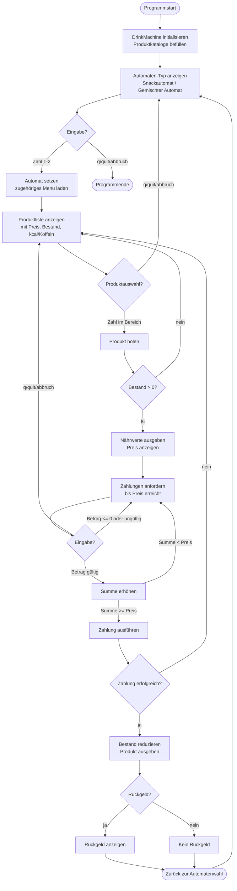

```mermaid
flowchart TD
    A([Programmstart]) --> B[DrinkMachine initialisieren<br/>Produktkataloge befüllen]
    B --> C[Automaten-Typ anzeigen<br/>Snackautomat / Gemischter Automat]
    C --> D{Eingabe?}
    D -->|Zahl 1-2| E[Automat setzen<br/>zugehöriges Menü laden]
    D -->|q/quit/abbruch| Z([Programmende])

    E --> F[Produktliste anzeigen<br/>mit Preis, Bestand, kcal/Koffein]
    F --> G{Produktauswahl?}
    G -->|Zahl im Bereich| H[Produkt holen]
    G -->|q/quit/abbruch| C

    H --> I{Bestand > 0?}
    I -->|nein| F
    I -->|ja| J[Nährwerte ausgeben<br/>Preis anzeigen]

    J --> K[Zahlungen anfordern<br/>bis Preis erreicht]
    K --> L{Eingabe?}
    L -->|q/quit/abbruch| F
    L -->|Betrag <= 0 oder ungültig| K
    L -->|Betrag gültig| M[Summe erhöhen]
    M -->|Summe < Preis| K
    M -->|Summe >= Preis| N[Zahlung ausführen]

    N --> O{Zahlung erfolgreich?}
    O -->|nein| F
    O -->|ja| P[Bestand reduzieren<br/>Produkt ausgeben]
    P --> Q{Rückgeld?}
    Q -->|ja| R[Rückgeld anzeigen]
    Q -->|nein| S[Kein Rückgeld]
    R --> T([Zurück zur Automatenwahl])
    S --> T
    T --> C
```
