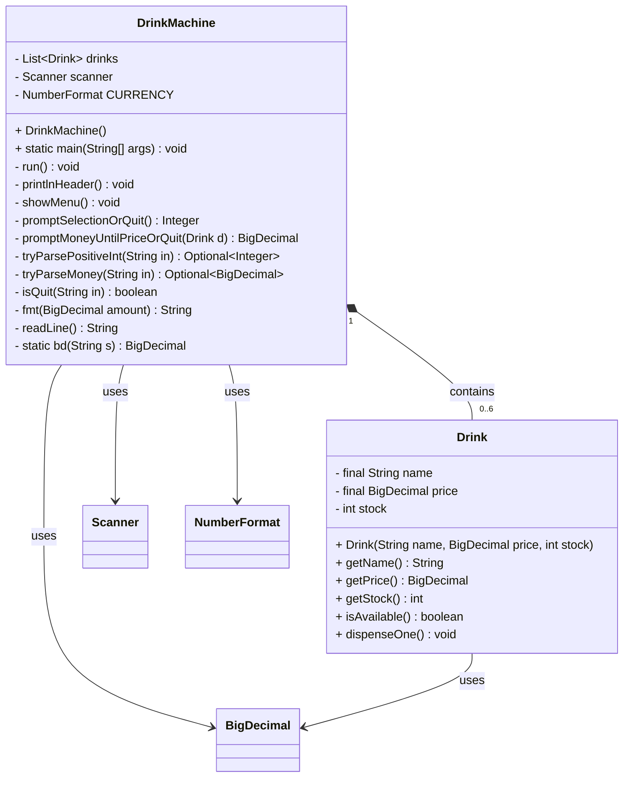
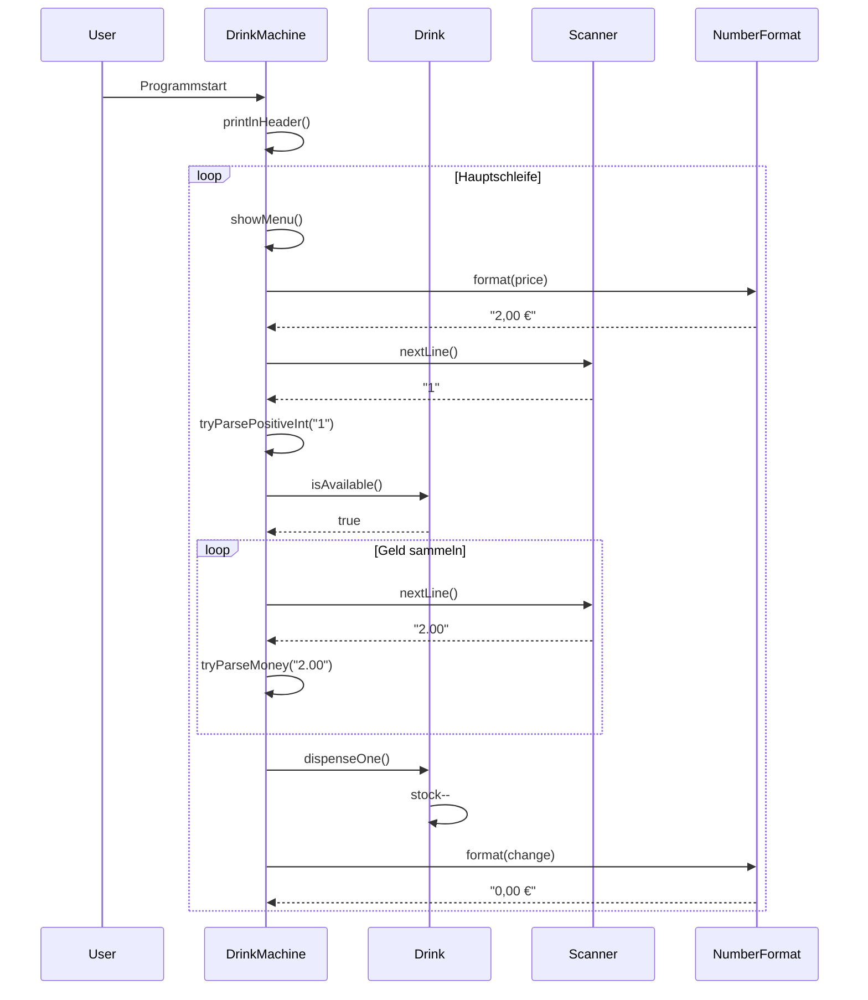
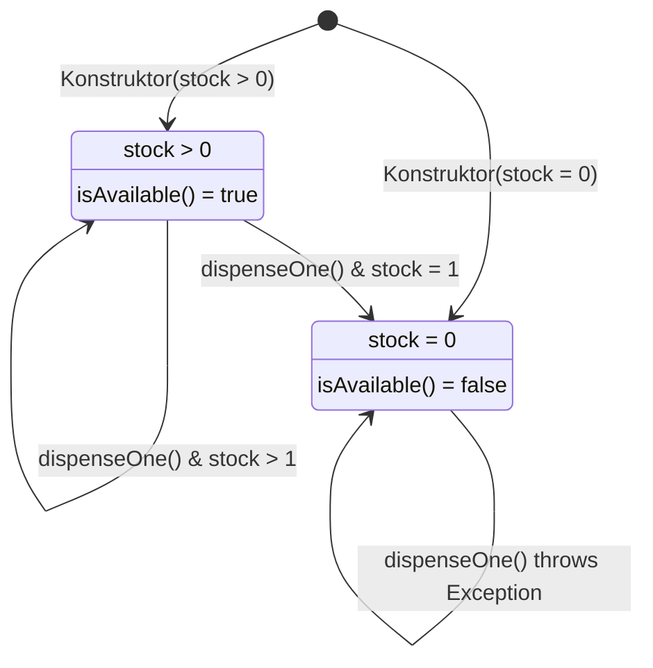
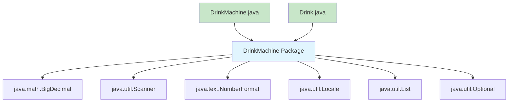

# DrinkMachine - UML-Klassendiagramm

## Übersicht

Dieses UML-Klassendiagramm zeigt die vollständige Struktur des DrinkMachine-Projekts mit beiden Klassen, ihren Attributen, Methoden und Beziehungen.

## Mermaid UML-Klassendiagramm



## Detaillierte Klassenbeschreibungen

### Klasse: DrinkMachine

**Klassifikation:** `public class`
**Zweck:** Hauptklasse für die Benutzerinteraktion und Geschäftslogik des Getränkeautomaten

#### Attribute

| Attribut | Typ | Sichtbarkeit | Modifikator | Beschreibung |
|----------|-----|--------------|-------------|--------------|
| drinks | List\<Drink\> | private | final | Liste aller verfügbaren Getränke |
| scanner | Scanner | private | final | Scanner für Benutzereingaben (System.in) |
| CURRENCY | NumberFormat | private | final | Deutsche Euro-Formatierung für Preise |

#### Methoden

##### Öffentliche Methoden

| Methode | Rückgabetyp | Parameter | Beschreibung |
|---------|-------------|-----------|--------------|
| DrinkMachine() | - | - | Konstruktor - Initialisiert Automat mit 6 Getränken |
| main(String[]) | void | args: String[] | Einstiegspunkt der Anwendung |

##### Private Methoden (Programmablauf)

| Methode | Rückgabetyp | Parameter | Beschreibung |
|---------|-------------|-----------|--------------|
| run() | void | - | Hauptschleife der Anwendung |
| printlnHeader() | void | - | Zeigt Begrüßung und Bedienungshinweise |
| showMenu() | void | - | Zeigt aktuelles Getränkemenü mit Preisen/Beständen |

##### Private Methoden (Eingabevalidierung)

| Methode | Rückgabetyp | Parameter | Beschreibung |
|---------|-------------|-----------|--------------|
| promptSelectionOrQuit() | Integer | - | Menüauswahl mit Validierung, null bei Abbruch |
| promptMoneyUntilPriceOrQuit() | BigDecimal | d: Drink | Geldsammlung bis Preis erreicht, null bei Abbruch |
| tryParsePositiveInt() | Optional\<Integer\> | in: String | Parst positive Ganzzahlen mit RegEx-Validierung |
| tryParseMoney() | Optional\<BigDecimal\> | in: String | Parst Geldbeträge (Komma/Punkt, 1-2 Dezimalstellen) |
| isQuit() | boolean | in: String | Prüft auf Abbruchbefehle ('q', 'quit', 'abbruch') |

##### Private Methoden (Utility)

| Methode | Rückgabetyp | Parameter | Beschreibung |
|---------|-------------|-----------|--------------|
| fmt() | String | amount: BigDecimal | Formatiert Betrag als deutsche Währung (z.B. "2,50 €") |
| readLine() | String | - | Sichere Scanner-Eingabe mit Exception-Handling |
| bd() | BigDecimal | s: String | Static Factory für BigDecimal mit Scale=2, HALF_UP |

### Klasse: Drink

**Klassifikation:** `package-private class`
**Zweck:** Datencontainer für einzelne Getränke mit Geschäftslogik

#### Attribute

| Attribut | Typ | Sichtbarkeit | Modifikator | Beschreibung |
|----------|-----|--------------|-------------|--------------|
| name | String | private | final | Getränkename (unveränderlich nach Erstellung) |
| price | BigDecimal | private | final | Preis in Euro (unveränderlich nach Erstellung) |
| stock | int | private | - | Aktueller Bestand (verändert sich bei Verkäufen) |

#### Methoden

##### Öffentliche Methoden

| Methode | Rückgabetyp | Parameter | Validierung | Beschreibung |
|---------|-------------|-----------|-------------|--------------|
| Drink() | - | name: String<br/>price: BigDecimal<br/>stock: int | name ≠ null/empty<br/>price ≥ 0<br/>stock ≥ 0 | Konstruktor mit Parametervalidierung |
| getName() | String | - | - | Getter für Getränkename |
| getPrice() | BigDecimal | - | - | Getter für Preis |
| getStock() | int | - | - | Getter für aktuellen Bestand |
| isAvailable() | boolean | - | - | Prüft Verfügbarkeit (stock > 0) |
| dispenseOne() | void | - | Wirft IllegalStateException wenn stock = 0 | Reduziert Bestand um 1 |

## Klassenbeziehungen

### Komposition (DrinkMachine *-- Drink)

**Beziehungstyp:** Komposition (starke Aggregation)
**Multiplizität:** 1:0..6
**Bedeutung:** 
- DrinkMachine enthält 0 bis 6 Drink-Objekte
- Drink-Objekte existieren nur im Kontext einer DrinkMachine-Instanz
- Bei Zerstörung der DrinkMachine werden auch alle Drink-Objekte zerstört

```java path=/Users/ilyabashlyaev/RBBK/Mittelstufe/STD/OOP/DrinkMachine/DrinkMachine.java start=32
private final List<Drink> drinks = new ArrayList<>();
```

### Abhängigkeitsbeziehungen

#### DrinkMachine → Scanner
**Beziehungstyp:** Verwendung (Uses)
**Zweck:** Eingabeoperationen von der Konsole
```java path=/Users/ilyabashlyaev/RBBK/Mittelstufe/STD/OOP/DrinkMachine/DrinkMachine.java start=35
private final Scanner scanner = new Scanner(System.in);
```

#### DrinkMachine → NumberFormat
**Beziehungstyp:** Verwendung (Uses)
**Zweck:** Deutsche Euro-Formatierung für Ausgaben
```java path=/Users/ilyabashlyaev/RBBK/Mittelstufe/STD/OOP/DrinkMachine/DrinkMachine.java start=38
private final NumberFormat CURRENCY = NumberFormat.getCurrencyInstance(Locale.GERMANY);
```

#### DrinkMachine → BigDecimal
**Beziehungstyp:** Verwendung (Uses)
**Zweck:** Präzise Geldberechnungen ohne Fließkommafehler

#### Drink → BigDecimal  
**Beziehungstyp:** Verwendung (Uses)
**Zweck:** Preisspeicherung mit Cent-Genauigkeit

## Architektur-Pattern

### Model-View-Controller Aspekte

Das Projekt zeigt Elemente des MVC-Patterns:

**Model (Datenmodell):**
- `Drink`-Klasse repräsentiert Geschäftsdaten
- Validierung und Geschäftsregeln in der Datenklasse

**View (Präsentation):**
- Konsolen-Ein/Ausgabe in DrinkMachine
- Formatierung durch NumberFormat und utility-Methoden

**Controller (Steuerung):**
- Hauptlogik in `run()` und Eingabevalidierungsmethoden
- Koordination zwischen Benutzerinteraktion und Datenmanipulation

### Defensive Programmierung

**Eingabevalidierung:**
```java path=/Users/ilyabashlyaev/RBBK/Mittelstufe/STD/OOP/DrinkMachine/Drink.java start=27
if (name == null || name.isBlank()) throw new IllegalArgumentException("name");
if (price == null || price.compareTo(BigDecimal.ZERO) < 0) throw new IllegalArgumentException("price");
if (stock < 0) throw new IllegalArgumentException("stock");
```

**Immutability:**
- Drink-Attribute `name` und `price` sind `final`
- BigDecimal-Objekte sind unveränderlich
- Nur `stock` ist veränderbar (Geschäftslogik erfordert dies)

### Single Responsibility Principle

**DrinkMachine:**
- Verantwortlich für Benutzerinteraktion
- Koordiniert Programmablauf
- Handhabt Eingabevalidierung

**Drink:**
- Verantwortlich für Getränke-Datenmodell
- Kapselt Geschäftsregeln für einzelne Getränke
- Bietet unveränderliche Schnittstelle für kritische Daten

## Sequenzdiagramm für typischen Kaufvorgang



## Zustandsdiagramm für Drink-Objekte



## Package-Diagramm



## Komplexitätsanalyse

### Zyklomatische Komplexität

**DrinkMachine.run():** 
- 2 Verzweigungen (null-checks, continue-statements)
- Komplexität: 3 (niedrig)

**DrinkMachine.promptSelectionOrQuit():**
- 4 Verzweigungen (quit-check, parsing-check, range-check, continue-loops)  
- Komplexität: 5 (mittel)

**DrinkMachine.promptMoneyUntilPriceOrQuit():**
- 5 Verzweigungen (while-loop, quit-check, parsing-check, value-check, continue-loops)
- Komplexität: 6 (mittel)

### Wartbarkeit

**Vorteile:**
- Klare Trennung der Verantwortlichkeiten
- Umfassende Eingabevalidierung
- Aussagekräftige Methodennamen
- Konsistente Fehlerbehandlung

**Potentielle Verbesserungen:**
- Extrahierung von Constants für Magic Numbers
- Factory-Pattern für Drink-Erstellung
- Strategy-Pattern für verschiedene Validierungsregeln

Diese Architektur ermöglicht einfache Erweiterungen (neue Getränke, andere Währungen, verschiedene Bezahlmethoden) bei gleichzeitig hoher Robustheit und Benutzerfreundlichkeit.
