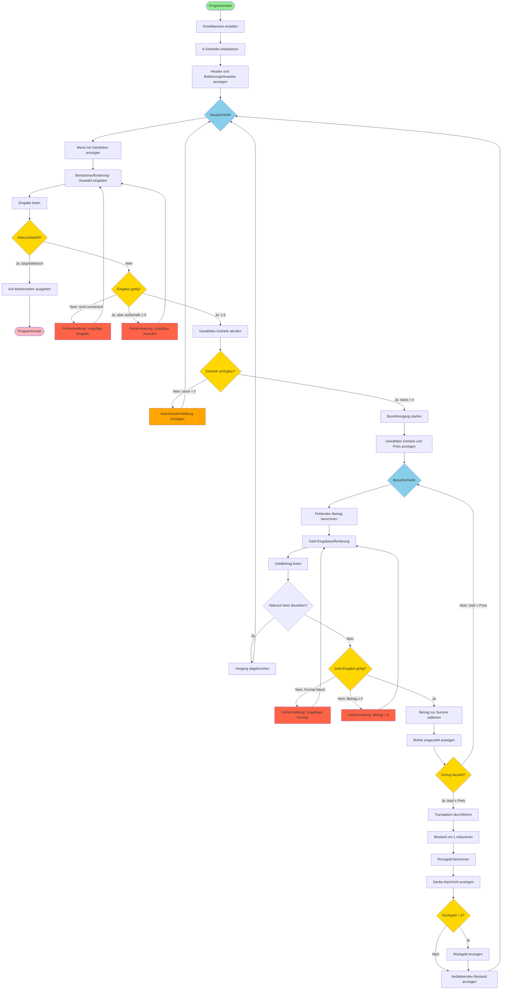
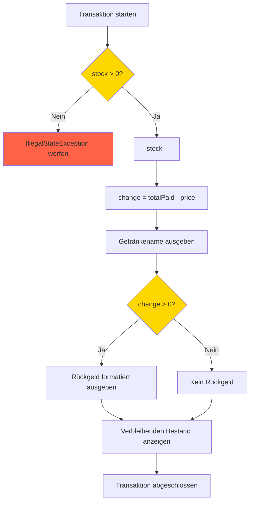
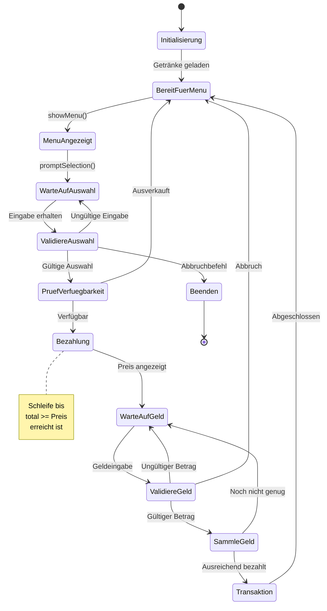
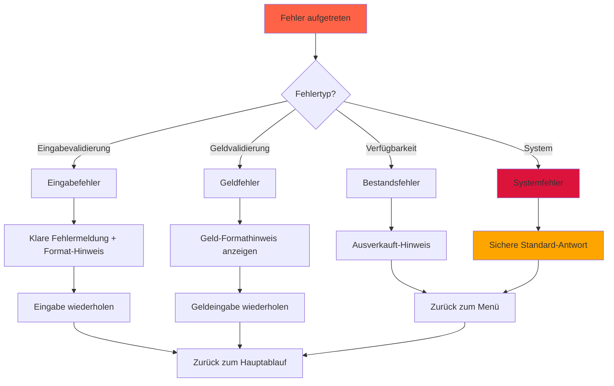
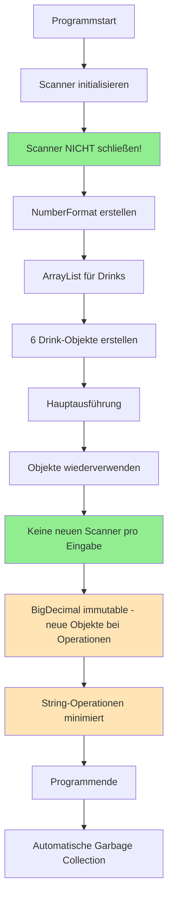
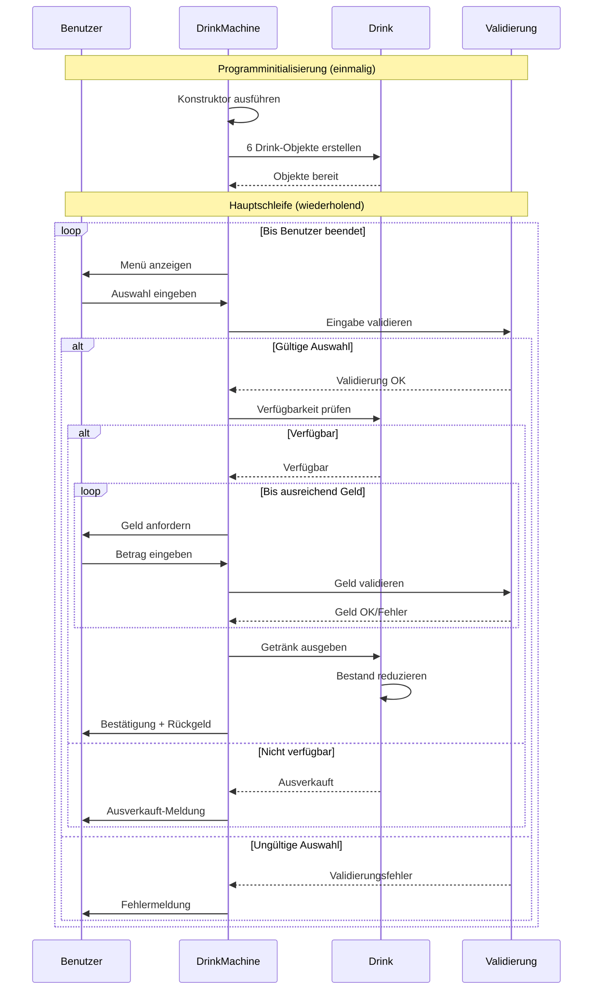
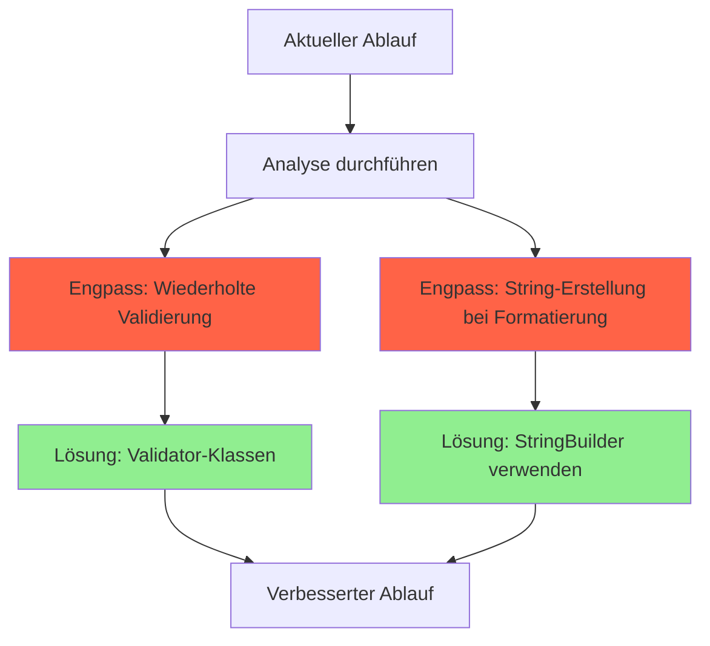

# DrinkMachine - Aktivitätsdiagramm

## Übersicht

Dieses Aktivitätsdiagramm zeigt den vollständigen Ablauf des DrinkMachine-Programms vom Programmstart bis zum Beenden. Es visualisiert alle Entscheidungspunkte, Schleifen und parallele Aktivitäten.

## Haupt-Aktivitätsdiagramm



## Detaillierte Teilprozesse

### 1. Eingabe-Validierungsprozess (Menüauswahl)

```mermaid
flowchart TD
    ReadInput[Eingabe lesen: readLine()] --> TrimInput[Eingabe trimmen]
    TrimInput --> CheckQuitCmd{isQuit(input)?}
    
    CheckQuitCmd -->|Ja| ReturnNull[return null]
    CheckQuitCmd -->|Nein| ParseInt[tryParsePositiveInt(input)]
    
    ParseInt --> RegexCheck{Regex \\d+ erfüllt?}
    RegexCheck -->|Nein| ReturnEmpty1[Optional.empty()]
    RegexCheck -->|Ja| TryParse[Integer.parseInt()]
    
    TryParse -->|Exception| ReturnEmpty2[Optional.empty()]
    TryParse -->|Erfolg| CheckRange{1 ≤ value ≤ 6?}
    
    CheckRange -->|Nein| ShowRangeError[Bereichsfehler anzeigen]
    ShowRangeError --> ReadInput
    CheckRange -->|Ja| ReturnValue[Gültigen Wert zurückgeben]
    
    ReturnEmpty1 --> ShowFormatError[Formatfehler anzeigen]
    ReturnEmpty2 --> ShowFormatError
    ShowFormatError --> ReadInput
    
    style RegexCheck fill:#FFD700
    style CheckRange fill:#FFD700
    style TryParse fill:#DDA0DD
```

### 2. Geld-Validierungsprozess

```mermaid
flowchart TD
    ReadMoney[Geldbetrag lesen] --> TrimMoney[String trimmen]
    TrimMoney --> MoneyRegex{Regex \\d+(?:[.,]\\d{1,2})? erfüllt?}
    
    MoneyRegex -->|Nein| MoneyFormatError[Format-Fehlermeldung]
    MoneyFormatError --> ReadMoney
    
    MoneyRegex -->|Ja| NormalizeDecimal[Komma zu Punkt konvertieren]
    NormalizeDecimal --> CreateBigDecimal[BigDecimal erstellen mit Scale=2]
    
    CreateBigDecimal -->|Exception| MoneyParseError[Parse-Fehlermeldung]
    MoneyParseError --> ReadMoney
    
    CreateBigDecimal -->|Erfolg| CheckPositive{Betrag > 0?}
    CheckPositive -->|Nein| PositiveError[Positiv-Fehlermeldung]
    PositiveError --> ReadMoney
    
    CheckPositive -->|Ja| ReturnAmount[Gültigen Betrag zurückgeben]
    
    style MoneyRegex fill:#FFD700
    style CheckPositive fill:#FFD700
    style CreateBigDecimal fill:#DDA0DD
```

### 3. Transaktionsprozess



## Parallelitäts- und Zustandsdiagramm

### Objektzustände während der Ausführung



## Fehlerbehandlungs-Aktivitäten



## Performance-Aktivitäten

### Speicher- und Ressourcenmanagement



## Datenfluss-Aktivitäten

```mermaid
flowchart LR
    subgraph Input["Eingabe-Schicht"]
        UserInput[Benutzereingabe]
        Scanner[Scanner.nextLine]
        RawString[Roher String]
    end
    
    subgraph Validation["Validierungs-Schicht"]
        RegexCheck[RegEx-Prüfung]
        TypeConversion[Typ-Konvertierung]
        RangeCheck[Bereichsprüfung]
    end
    
    subgraph Business["Geschäftslogik-Schicht"]
        DrinkSelection[Getränkeauswahl]
        AvailabilityCheck[Verfügbarkeitsprüfung]
        PaymentProcessing[Bezahlungsverarbeitung]
        StockUpdate[Bestandsupdate]
    end
    
    subgraph Output["Ausgabe-Schicht"]
        Formatting[Deutsche Formatierung]
        DisplayMessage[Nachrichtenanzeige]
        UserFeedback[Benutzer-Rückmeldung]
    end
    
    UserInput --> Scanner
    Scanner --> RawString
    RawString --> RegexCheck
    RegexCheck --> TypeConversion
    TypeConversion --> RangeCheck
    RangeCheck --> DrinkSelection
    DrinkSelection --> AvailabilityCheck
    AvailabilityCheck --> PaymentProcessing
    PaymentProcessing --> StockUpdate
    StockUpdate --> Formatting
    Formatting --> DisplayMessage
    DisplayMessage --> UserFeedback
    
    style Input fill:#E6F3FF
    style Validation fill:#FFE6CC
    style Business fill:#E6FFE6
    style Output fill:#FFE6F3
```



## Zeitliche Abläufe (Timing-Diagramm)



## Komplexitäts-Kennzahlen

### Aktivitäts-Metriken

| Kategorie | Anzahl | Komplexität | Beschreibung |
|-----------|--------|-------------|--------------|
| **Entscheidungspunkte** | 12 | Hoch | Viele Validierungs- und Prüfschritte |
| **Schleifen** | 2 | Mittel | Hauptschleife + Bezahlschleife |
| **Fehlerbehandlungen** | 8 | Mittel | Umfassende Eingabevalidierung |
| **Zustandsübergänge** | 15 | Hoch | Viele verschiedene Programmzustände |
| **Parallele Aktivitäten** | 0 | Niedrig | Sequenzieller Ablauf |

### Optimierungspotentiale



Dieses umfassende Aktivitätsdiagramm zeigt alle Aspekte des DrinkMachine-Programms: vom einfachen linearen Ablauf über komplexe Verzweigungen bis hin zu Fehlerbehandlung und Performance-Überlegungen. Es dient als vollständige Referenz für das Verständnis des Programmverhaltens und kann für Debugging, Optimierung oder Weiterentwicklung verwendet werden.
