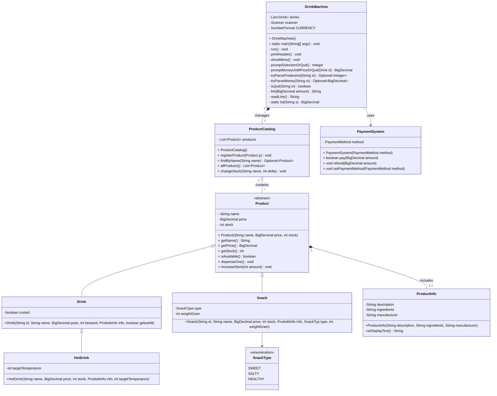

```mermaid
classDiagram
    class DrinkMachine {
        - List~Drink~ drinks
        - Scanner scanner
        - NumberFormat CURRENCY
        
        + DrinkMachine()
        + static main(String[] args) void
        
        - run() void
        - printHeader() void
        - showMenu() void
        - promptSelectionOrQuit() Integer
        - promptMoneyUntilPriceOrQuit(Drink d) BigDecimal
        - tryParsePositiveInt(String in) Optional~Integer~
        - tryParseMoney(String in) Optional~BigDecimal~
        - isQuit(String in) boolean
        - fmt(BigDecimal amount) String
        - readLine() String
        - static bd(String s) BigDecimal
    }
    
    class Product {
        <<abstract>>
        - String name
        - BigDecimal price
        - int stock
        + Product(String name, BigDecimal price, int stock)
        + getName() String
        + getPrice() BigDecimal
        + getStock() int
        + isAvailable() boolean
        + dispenseOne() void
        + increaseStock(int amount) void
    }

    class Drink {
        -boolean cooled
        +Drink(String id, String name, BigDecimal preis, int bestand, ProduktInfo info, boolean gekuehlt)
    }

    class HotDrink {
        -int targetTemperature
        +HotDrink(String name, BigDecimal price, int stock, ProduktInfo info, int targetTemperature)
    }

    class Snack {
        -SnackType type
        -int weightGram
        
        +Snack(String id, String name, BigDecimal price, int stock, ProduktInfo info, SnackTyp type, int weightGram)
    }

    class SnackType {
        <<enumeration>>
        SWEET
        SALTY
        HEALTHY
    }

    class ProductInfo {
        -String description
        -String ingredients
        -String manufacturer
        +ProductInfo(String description, String ingredients, String manufacturer)
        +toDisplayText() String
    }

    class ProductCatalog {
        - List~Product~ products
        + ProductCatalog()
        + registerProduct(Product p) void
        + findByName(String name) Optional~Product~
        + allProducts() List~Product~
        + changeStock(String name, int delta) void
    }
    
    class PaymentSystem {
        - PaymentMethod method
        + PaymentSystem(PaymentMethod method)
        + boolean pay(BigDecimal amount)
        + void refund(BigDecimal amount)
        + void setPaymentMethod(PaymentMethod method)
    }
    
    DrinkMachine "1" *-- "1" ProductCatalog : manages
    ProductCatalog "1" o-- "*" Product : contains
    Product "1" *-- "0..1" ProductInfo : includes
    Product <|-- Drink
    Drink <|-- HotDrink
    Product <|-- Snack
    Snack --> SnackType
    DrinkMachine --> PaymentSystem : uses
```