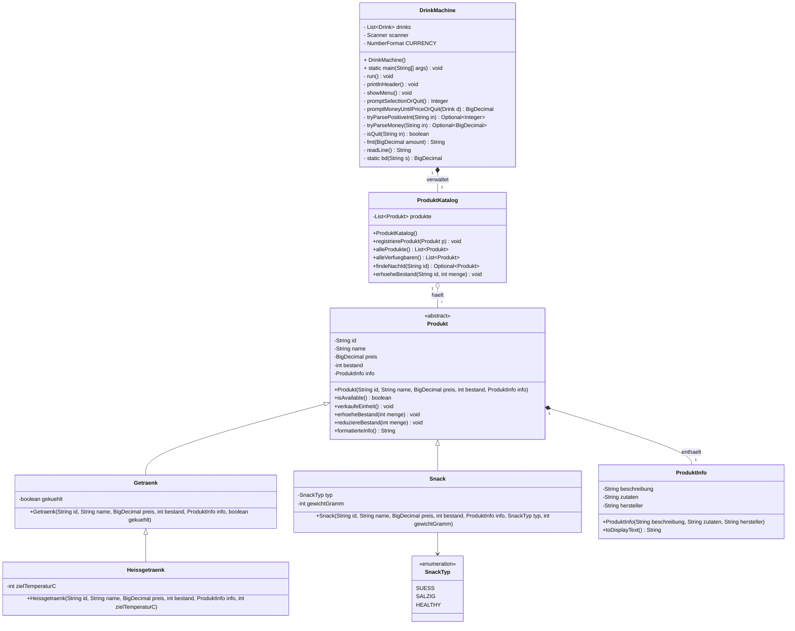

# DrinkMachine – erweitertes UML-Klassendiagramm

Erweiterte Struktur zur Aufnahme von Snacks und Heissgetraenken, Pflege von Produktinformationen sowie dynamischer Bestandsaenderung. Die bisherige Klasse `Drink` wird durch die abstrakte Basisklasse `Produkt` ersetzt.

